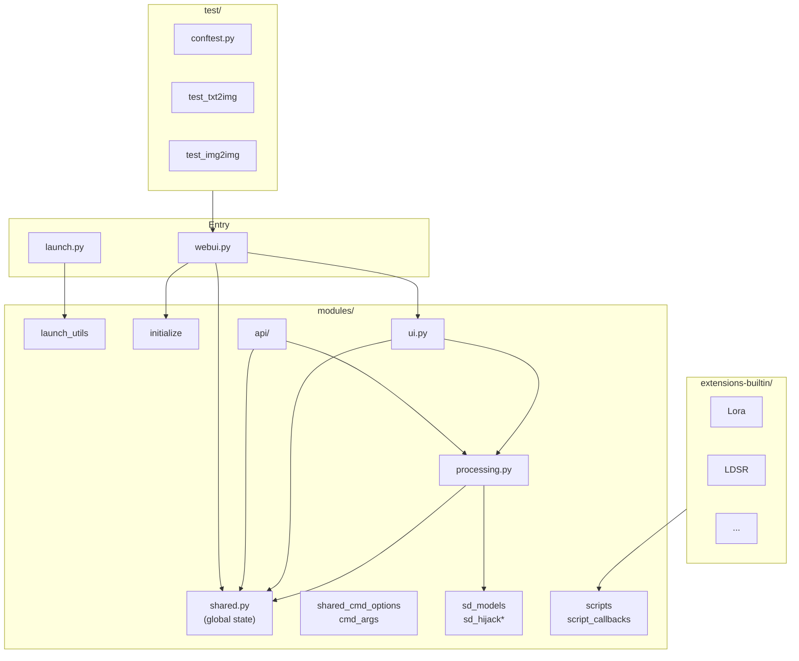

# Codebase Audit: Stable Diffusion Web UI (serena)

**Auditor:** CodeAuditorGPT (staff-plus posture)  
**Repo:** stable-diffusion-webui (workspace: `c:\coding\refactoring\serena`)  
**Commit:** `82a973c04367123ae98bd9abdf80d9eda9b910e2`  
**Audit date:** 2025-03-05  
**Mode:** Snapshot (one-shot); some inputs inferred from repo (see Input Contract note below).

**Input Contract note:** Not all required inputs were provided (e.g. test results/coverage summary, security scan output, SLAs, team size). Findings are based on repo structure, CI configs, dependency manifests, and code inspection. Where blocked, recommendations request the minimal next artifact.

---

## 1. Executive Summary

**Strengths**
- **Clear entry points and layering:** `webui.py` / `launch.py` delegate to `modules/`; API and UI are separated (`modules/api/`, `modules/ui.py`). **Evidence:** `webui.py:19-24`, `launch.py` delegates to `launch_utils`.
- **CI runs both Python (ruff) and JS (eslint) lint, plus a full pytest suite against a live server** with coverage collection and artifact upload on failure. **Evidence:** `.github/workflows/on_pull_request.yaml`, `.github/workflows/run_tests.yaml`.
- **Python lint and test tooling is modern:** Ruff and pytest with `pyproject.toml` and `pytest-base-url` for API tests. **Evidence:** `pyproject.toml`, `requirements-test.txt`.

**Biggest opportunities**
- **No test tiers or coverage enforcement:** All tests run in one job; no smoke vs quality vs nightly; no `--cov-fail-under`. CI can be slow and flaky without a fast gate; coverage can regress silently. **Evidence:** `run_tests.yaml:58-61` (single pytest run, no threshold).
- **Dependency and CI hygiene gaps:** `requirements.txt` mixes pinned and unpinned deps; npm lockfile is gitignored; CI actions use tags (`@v4`, `@v5`) not immutable SHAs; `npm i --ci` used instead of `npm ci`. **Evidence:** `requirements.txt` (e.g. `fastapi>=0.90.1`), `.gitignore:40` (`/package-lock.json`), `on_pull_request.yaml:36`, `run_tests.yaml:14`.
- **Tight coupling and shared global state:** `modules/shared.py` and `modules/ui.py` are hubs; `processing.py` and `api/api.py` import many modules. Refactors and testing are harder. **Evidence:** `shared.py:6-8`, `ui.py:16-17`, `processing.py:19-31`.

**Overall score (weighted):** **2.6 / 5**  
**Heatmap:**

| Area              | Score | Note                          |
|-------------------|-------|-------------------------------|
| Architecture      | 3     | Clear entry points; hub modules |
| Modularity        | 2     | Heavy coupling to shared/ui   |
| Code health       | 3     | Ruff; some ignores; big files |
| Tests & CI        | 2     | No tiers, no coverage gate    |
| Security & supply | 2     | No dep/secret scan in CI      |
| Performance       | 3     | Not primary focus; CPU path   |
| DX                | 2     | No single “new dev” path      |
| Docs              | 2     | README/wiki; no CONTRIBUTING  |

---

## 2. Codebase Map



**Drift vs intended architecture:** The repo is a single Gradio/FastAPI app with a large `modules/` package. There is no documented “intended” architecture; the map reflects actual structure. **Observation:** `shared.py` and `ui.py` act as facades and global state holders; many modules depend on them, which matches a typical “script-style” web UI rather than a layered service architecture. **Evidence:** `modules/shared.py:1-80`, `modules/ui.py:16-23`.

---

## 3. Modularity & Coupling

**Score: 2 / 5**

**Top 3 tight couplings (impact + surgical decouplings)**

1. **`shared` as global state hub**  
   - **Impact:** Many modules import `shared` for `opts`, `state`, `sd_model`, etc. Changes to options or state affect many call sites; unit testing requires heavy mocking.  
   - **Evidence:** `modules/shared.py:44-47` (`opts`, `state`), and grep of `from modules import shared` / `import modules.shared` across `modules/` (dozens of files).  
   - **Surgical decoupling:** Introduce a small `options`/`state` accessor layer used by UI and API; keep `shared` as the single place that *writes* options/state, but have core logic (e.g. `processing`) take options as arguments in new functions. One PR: add `processing.run_txt2img(opts_snapshot, ...)` that reads from a struct instead of `shared.opts`.

2. **`ui.py` importing most of the app**  
   - **Impact:** `ui.py` pulls in script_callbacks, sd_models, processing, ui_*, etc. Any UI change risks pulling in unrelated code; startup and test load are high.  
   - **Evidence:** `modules/ui.py:16-17` (long import list).  
   - **Surgical decoupling:** Split UI into tab-specific modules that are loaded on demand (e.g. lazy import for “Extras” tab). One PR: move one tab’s UI construction into `ui_extras.py` and import it only when that tab is selected.

3. **`processing.py` and model/script coupling**  
   - **Impact:** `processing.py` imports `sd_hijack`, `sd_models`, `scripts`, `ldm.*`, etc. Hard to test processing logic without loading models or scripts.  
   - **Evidence:** `modules/processing.py:19-31`.  
   - **Surgical decoupling:** Introduce interfaces (e.g. “sampler provider”, “model loader”) and inject them into processing. One PR: add a thin `ProcessingRunner` that takes a model interface and call `process_images` with it so tests can pass a mock.

---

## 4. Code Quality & Health

**Observations (facts):**
- Ruff is configured in `pyproject.toml` with select rules (B, C, I, W) and per-file ignores; E501, E721, E731, and others are ignored. **Evidence:** `pyproject.toml:1-35`.
- `.pylintrc` disables all message groups (C, R, W, E, I). **Evidence:** `.pylintrc:2-3`.
- Large files exist (e.g. `processing.py`, `ui.py` in the thousands of lines), which Ruff’s C901 is explicitly ignored for. **Evidence:** `pyproject.toml:26`.

**Interpretation:** Lint is focused on a subset of issues; complexity and line length are not enforced. This is common for a UI-heavy codebase but increases the risk of subtle bugs in hot paths.

**Anti-pattern (example):** Broad `except` or re-export of many symbols from a single module can hide errors. **Evidence (re-exports):** `shared.py` re-exports `cmd_opts`, `OptionInfo`, etc., and is imported widely.

**Before/After (≤15 lines) – optional defensive guard:**

**Before** (hypothetical optional dependency):
```python
# In some module
from optional_otel import trace_span
def do_work():
    with trace_span("do_work"):
        ...
```

**After** (defensive import + guard):
```python
try:
    from optional_otel import trace_span
except ImportError:
    from contextlib import nullcontext
    trace_span = lambda n: nullcontext()
def do_work():
    with trace_span("do_work"):
        ...
```

*(No OTEL was found in this repo; the pattern is recommended if optional observability is added.)*

---

## 5. Docs & Knowledge

- **Onboarding path:** README describes installation (Windows/Linux), running via `webui-user.bat` / `webui.sh`, and links to wiki for dependencies and features. **Evidence:** `README.md:94-120`.
- **Single biggest doc gap:** There is no **CONTRIBUTING.md** or equivalent that explains: how to run tests locally, how to run lint, branch policy (e.g. “dev” vs “master”), and what CI checks are required. New contributors cannot reliably reproduce CI or know the bar for merging. **Recommendation:** Add a short CONTRIBUTING.md with: “Run `ruff .` and `npm run lint`; run `pytest test/` (see README for server prerequisites); open PRs against `dev`.”

---

## 6. Tests & CI/CD Hygiene

**Coverage:** CI runs `pytest ... --cov . --cov-report=xml` and uploads `htmlcov` on failure; no `--cov-fail-under` or threshold is set. **Evidence:** `.github/workflows/run_tests.yaml:61,65-69`. No statement/branch threshold or tool is configured in the repo.

**Flakiness:** Tests depend on a live server started in the same job (`launch.py --test-server` then `wait-for-it` then pytest). Any startup delay or port conflict can cause flakiness. **Evidence:** `run_tests.yaml:44-61`.

**Test pyramid:** All tests are integration-style (HTTP against the running app). There are no unit tests that run without the server, and no explicit smoke vs full suite. **Evidence:** `test/test_txt2img.py:42-43`, `conftest.py:34-36` (session fixture imports `webui`).

**3-tier architecture assessment:** **Not present.** There is a single “run everything” test job. **Recommendation:** Introduce Tier 1 (smoke): small subset of tests or a health endpoint, low threshold (e.g. 5%), required; Tier 2 (quality): main API tests with a coverage margin (e.g. current −2%); Tier 3 (nightly): full suite + coverage report, non-blocking with alerting.

**Required checks:** Linter and Tests run on push/PR; `warns_merge_master.yml` fails PRs that target `master`. There is no branch protection evidence in the repo (lives in GitHub settings). **Evidence:** `on_pull_request.yaml:3-5`, `run_tests.yaml:3-5`, `warns_merge_master.yml:9-12`.

**Caches:** Pip cache key includes `**/requirements*txt` and `launch.py`; models cached with key `2023-12-30`. **Evidence:** `run_tests.yaml:19-28`.

**Artifacts:** `output.txt` and `htmlcov` uploaded when the job runs (including on failure). **Evidence:** `run_tests.yaml:70-80`.

**Guardrail gaps:** (1) No coverage threshold. (2) CI uses `npm i --ci` instead of `npm ci`; (3) lockfile not in repo. (4) Actions use `@v4`/`@v5` (tags), not immutable SHAs. (5) No explicit test paths/markers for tiers (only `test` directory).

---

## 7. Security & Supply Chain

- **Secret hygiene:** API uses `secrets.compare_digest` for auth. **Evidence:** `modules/api/api.py:17`. No evidence of secrets in repo; no dedicated secret scan in CI.
- **Dependency risk/pinning:** `requirements.txt` has mixed pinning (e.g. `fastapi>=0.90.1`, `gradio==3.41.2`). `requirements_versions.txt` pins many deps. CI does not install from a single locked manifest; `run_tests.yaml` uses `requirements-test.txt` and `launch.py --skip-prepare-environment` with `TORCH_INDEX_URL` for CPU. **Evidence:** `requirements.txt`, `requirements_versions.txt`, `run_tests.yaml:29-40`.
- **SBOM:** No SBOM or dependency export found in repo or workflows.
- **CI trust boundaries:** Workflows checkout code and run pip/npm; no explicit restriction to approved actions. Pinning to SHAs would reduce supply-chain risk from action updates.

**Recommendations:** (1) Add a scheduled or PR job that runs `pip-audit` (and optionally `npm audit`) and fails or warns on known vulns. (2) Use a single pinned manifest for CI (e.g. `requirements_versions.txt` or a generated lockfile) and pin CI actions to full SHAs.

---

## 8. Performance & Scalability

- **Hot paths:** Image generation flows through `processing.process_images` and model forward passes; `modules/processing.py` and samplers are central. **Evidence:** `processing.py`, `modules/sd_samplers*.py`.
- **IO/N+1:** Not analyzed in depth; no ORM. File I/O for models and images is expected to be significant.
- **Caching:** Models and configs are loaded and cached in memory; `diskcache` is in requirements. **Evidence:** `requirements.txt` (diskcache), `modules/cache.py`.
- **Parallelism:** Gradio queue (e.g. 64) for UI; API uses a queue lock. **Evidence:** `webui.py:69`, `modules/call_queue.py`.
- **Perf budgets:** No SLOs or perf budgets documented in repo. Performance is not the stated primary concern in README (features and compatibility are).
- **Concrete profiling plan:** (1) Run a single txt2img request with `python -m cProfile -o trace.stats launch.py ...` (or equivalent) and inspect `trace.stats` for hotspots. (2) Add a simple “health” or “timing” endpoint that returns startup time and last-request latency. (3) If GPU is in scope, use PyTorch profiler for one batch.

---

## 9. Developer Experience (DX)

- **15-minute new-dev journey (measured steps + blockers):**  
  (1) Clone repo. (2) Install Python 3.10.x and (for full app) GPU stack per README. (3) Run `webui-user.bat` or `webui.sh` → first run installs deps via `launch.py`. (4) Run `ruff .` and `npm run lint` (need Node for eslint). (5) Run tests: must start environment (e.g. `launch.py --skip-torch-cuda-test --exit` then `launch.py --test-server ...` in background) then `pytest test/`. **Blockers:** No single “run tests” script; CONTRIBUTING missing; `package-lock.json` gitignored so `npm ci` is not possible for reproducible JS deps.

- **5-minute single-file change:** Edit file → run `ruff .` (and eslint if JS) → run relevant pytest (e.g. `pytest test/test_txt2img.py -v`). **Blocker:** Tests require a running server; no unit-only fast path.

- **3 immediate wins:** (1) Add CONTRIBUTING.md with “run ruff, eslint, pytest” and branch policy. (2) Add a script (e.g. `scripts/run_tests_local.sh`) that starts the test server in background, runs pytest, then stops server. (3) Commit `package-lock.json` and switch CI to `npm ci` for reproducible lint.

---

## 10. Refactor Strategy (Two Options)

**Option A — Iterative (phased PRs, low blast radius)**  
- **Rationale:** Reduces risk; each PR is reviewable and revertible.  
- **Goals:** Introduce test tiers, add coverage gate with margin, pin deps and actions, improve docs and DX.  
- **Migration steps:** Phase 0: add minimal smoke check and pin one high-impact action to SHA. Phase 1: add CONTRIBUTING and marker/path discipline for tests. Phase 2: add coverage threshold (current −2%) to a “quality” job; make smoke required. Phase 3: optional nightly job and dependency audit.  
- **Risks:** Slow; some changes (e.g. decoupling `shared`) need many small steps.  
- **Rollback:** Each PR is independently revertible; keep feature flags for any new CI jobs.

**Option B — Strategic (structural)**  
- **Rationale:** Address coupling and testability in a coordinated way.  
- **Goals:** Introduce a clear service/business layer between API/UI and `processing`; add interfaces for model/sampler; split UI into load-on-demand tabs; introduce 3-tier CI and coverage enforcement.  
- **Migration steps:** (1) Add interfaces and one “runner” that uses them; (2) Migrate one API endpoint to use runner; (3) Split one UI tab; (4) Add smoke + quality + nightly jobs and coverage threshold.  
- **Risks:** Larger PRs; possible breakage for extensions that rely on current `shared`/import structure.  
- **Rollback:** Feature flags for new paths; keep old paths until stable; branch-based rollout.

**Tools:** Ruff, pytest, coverage, pip-audit; optional: pre-commit for ruff/eslint.

---

## 11. Future-Proofing & Risk Register

| Risk | Likelihood | Impact | Mitigation |
|------|------------|--------|------------|
| Dependency vuln in PyTorch/Gradio | Medium | High | pip-audit in CI; pin major deps |
| Flaky CI (server startup) | Medium | Medium | Smoke tier with health endpoint; retries or longer wait-for-it |
| Coverage regression | High | Medium | Add --cov-fail-under with 2% margin |
| Action/plugin compromise | Low | High | Pin actions to full SHA |
| Breaking extension API | Low | High | Document extension contract; deprecation path for shared/opts |

**ADRs to lock decisions:** (1) “We use a 3-tier test strategy (smoke / quality / nightly).” (2) “CI installs from pinned manifests and uses SHA-pinned actions.” (3) “New code in `modules/` should prefer dependency injection over importing `shared` in hot paths where feasible.”

---

## 12. Phased Plan & Small Milestones (PR-sized)

Each milestone is ≤60 minutes and mergeable as its own PR.

**Phase 0 — Fix-First & Stabilize (0–1 day)**

| ID | Milestone | Category | Acceptance Criteria | Risk | Rollback | Est | Owner |
|----|-----------|-----------|----------------------|------|----------|-----|-------|
| P0-1 | Add smoke gate: single health or txt2img test, run first, required | CI | New job or step runs 1 test; required on PR | Low | Remove step | 1h | - |
| P0-2 | Pin `actions/checkout` and `actions/setup-python` to full SHA in both workflows | CI | Both workflows use `actions/checkout@<sha>` (and same for setup-python) | Low | Revert to @v4/@v5 | 0.5h | - |
| P0-3 | Upload test artifacts on failure only (already “always” in run_tests; add lint job logs on fail) | CI | Artifacts uploaded when job fails | Low | Revert | 0.5h | - |
| P0-4 | Add `pip-audit` (or `pip install pip-audit && pip-audit`) as non-blocking step in test workflow | Security | Step runs; fails on known vulns (or warn-only) | Low | Remove step | 0.5h | - |

**Phase 1 — Document & Guardrail (1–3 days)**

| ID | Milestone | Category | Acceptance Criteria | Risk | Rollback | Est | Owner |
|----|-----------|-----------|----------------------|------|----------|-----|-------|
| P1-1 | Add CONTRIBUTING.md with lint, test, branch policy | Docs | File exists; links from README | Low | Delete file | 1h | - |
| P1-2 | Add pytest markers (e.g. `@pytest.mark.smoke`) to 2–3 tests; document in CONTRIBUTING | Tests | `pytest -m smoke` runs subset | Low | Remove markers | 1h | - |
| P1-3 | Use explicit test path in CI: `pytest test/` (already) and add `-m "not slow"` or marker for smoke | CI | Smoke tier runs only marked tests | Low | Revert | 0.5h | - |
| P1-4 | Pin Ruff in workflow to exact version (already 0.3.3); add same for pytest/coverage in requirements-test.txt | Deps | requirements-test.txt pins pytest, pytest-cov, pytest-base-url | Low | Revert | 0.5h | - |
| P1-5 | Commit package-lock.json; change lint workflow to `npm ci` | CI/Deps | Lockfile in repo; workflow uses `npm ci` | Low | Revert commit, use `npm i --ci` | 0.5h | - |

**Phase 2 — Harden & Enforce (3–7 days)**

| ID | Milestone | Category | Acceptance Criteria | Risk | Rollback | Est | Owner |
|----|-----------|-----------|----------------------|------|----------|-----|-------|
| P2-1 | Add coverage threshold: `pytest ... --cov . --cov-fail-under=X` where X = (current_cov − 2)% | CI | Build fails if coverage below X | Medium | Remove flag | 1h | - |
| P2-2 | Make smoke job required in branch protection (document in CONTRIBUTING) | CI | README or CONTRIBUTING states smoke is required | Low | Doc change | 0.5h | - |
| P2-3 | Run full test suite in same job but after smoke; or add separate “quality” job with threshold | CI | Two tiers (smoke + full) or one job with ordered steps | Low | Revert | 1h | - |
| P2-4 | Add coverage variance alert (e.g. comment on PR with coverage diff) — optional | CI | Optional step posts comment | Low | Remove step | 1h | - |

**Phase 3 — Improve & Scale (weekly cadence)**

| ID | Milestone | Category | Acceptance Criteria | Risk | Rollback | Est | Owner |
|----|-----------|-----------|----------------------|------|----------|-----|-------|
| P3-1 | Add ADR or doc: “CI Architecture Guardrails” (3-tier, pinning, coverage margin) | Docs | Doc in repo | Low | Delete | 1h | - |
| P3-2 | Introduce `ProcessingRunner` (or similar) with one endpoint using it | Arch | One API path uses injected dependency | Medium | Revert | 2h | - |
| P3-3 | Add health/timing endpoint for smoke and profiling | Perf | GET returns 200 and startup/latency info | Low | Remove endpoint | 1h | - |
| P3-4 | Schedule weekly or nightly `pip-audit` and dependency update issue (optional) | Security | Scheduled workflow runs | Low | Disable | 0.5h | - |

---

## 13. Machine-Readable Appendix (JSON)

```json
{
  "issues": [
    {
      "id": "ARC-001",
      "title": "Introduce application/service layer between API and processing",
      "category": "architecture",
      "path": "modules/api/api.py:1-35",
      "severity": "medium",
      "priority": "medium",
      "effort": "medium",
      "impact": 4,
      "confidence": 0.8,
      "ice": 3.2,
      "evidence": "api.py imports processing, sd_models, scripts, etc. directly; no abstraction layer.",
      "fix_hint": "Add ProcessingRunner that takes opts and model interface; use in one endpoint first."
    },
    {
      "id": "MOD-001",
      "title": "Reduce shared.py global state coupling",
      "category": "modularity",
      "path": "modules/shared.py:1-80",
      "severity": "high",
      "priority": "high",
      "effort": "high",
      "impact": 5,
      "confidence": 0.9,
      "ice": 4.5,
      "evidence": "Dozens of modules import shared for opts, state, sd_model.",
      "fix_hint": "Pass opts/state snapshot into processing functions in one module first."
    },
    {
      "id": "CI-001",
      "title": "Add coverage threshold with 2% safety margin",
      "category": "tests_ci",
      "path": ".github/workflows/run_tests.yaml:61",
      "severity": "medium",
      "priority": "high",
      "effort": "low",
      "impact": 4,
      "confidence": 1.0,
      "ice": 4.0,
      "evidence": "pytest runs with --cov but no --cov-fail-under.",
      "fix_hint": "Add --cov-fail-under=(current-2) after measuring current coverage."
    },
    {
      "id": "CI-002",
      "title": "Pin GitHub Actions to immutable SHAs",
      "category": "security",
      "path": ".github/workflows/on_pull_request.yaml:14",
      "severity": "medium",
      "priority": "medium",
      "effort": "low",
      "impact": 3,
      "confidence": 1.0,
      "ice": 3.0,
      "evidence": "uses: actions/checkout@v4",
      "fix_hint": "Replace with actions/checkout@<full SHA> for checkout, setup-python, cache, upload-artifact."
    },
    {
      "id": "SEC-001",
      "title": "Add dependency audit in CI",
      "category": "security",
      "path": ".github/workflows/run_tests.yaml",
      "severity": "medium",
      "priority": "medium",
      "effort": "low",
      "impact": 4,
      "confidence": 0.9,
      "ice": 3.6,
      "evidence": "No pip-audit or npm audit in workflows.",
      "fix_hint": "Add step: pip install pip-audit && pip-audit (and optionally npm audit)."
    },
    {
      "id": "DOC-001",
      "title": "Add CONTRIBUTING.md with lint, test, branch policy",
      "category": "docs",
      "path": "README.md",
      "severity": "low",
      "priority": "high",
      "effort": "low",
      "impact": 3,
      "confidence": 1.0,
      "ice": 3.0,
      "evidence": "No CONTRIBUTING or local test/lint instructions.",
      "fix_hint": "Create CONTRIBUTING.md: ruff, eslint, pytest, open PRs to dev."
    }
  ],
  "scores": {
    "architecture": 3,
    "modularity": 2,
    "code_health": 3,
    "tests_ci": 2,
    "security": 2,
    "performance": 3,
    "dx": 2,
    "docs": 2,
    "overall_weighted": 2.6
  },
  "phases": [
    {
      "name": "Phase 0 — Fix-First & Stabilize",
      "milestones": [
        {
          "id": "P0-1",
          "milestone": "Add smoke gate with low threshold and artifacts on fail",
          "acceptance": ["One smoke test runs first", "Artifacts uploaded on fail"],
          "risk": "low",
          "rollback": "Remove job or step",
          "est_hours": 1
        },
        {
          "id": "P0-2",
          "milestone": "Pin actions/checkout and setup-python to full SHA",
          "acceptance": ["Workflows use @<sha> not @v4/@v5"],
          "risk": "low",
          "rollback": "Revert to tags",
          "est_hours": 0.5
        }
      ]
    },
    {
      "name": "Phase 1 — Document & Guardrail",
      "milestones": [
        {
          "id": "P1-1",
          "milestone": "Add CONTRIBUTING.md",
          "acceptance": ["File exists", "Documents lint, test, branch"],
          "risk": "low",
          "rollback": "Delete file",
          "est_hours": 1
        },
        {
          "id": "P1-2",
          "milestone": "Add pytest markers for smoke subset",
          "acceptance": ["pytest -m smoke runs subset"],
          "risk": "low",
          "rollback": "Remove markers",
          "est_hours": 1
        }
      ]
    },
    {
      "name": "Phase 2 — Harden & Enforce",
      "milestones": [
        {
          "id": "P2-1",
          "milestone": "Add --cov-fail-under with 2% margin",
          "acceptance": ["CI fails if coverage below threshold"],
          "risk": "medium",
          "rollback": "Remove flag",
          "est_hours": 1
        }
      ]
    },
    {
      "name": "Phase 3 — Improve & Scale",
      "milestones": [
        {
          "id": "P3-1",
          "milestone": "Document CI Architecture Guardrails",
          "acceptance": ["ADR or doc in repo"],
          "risk": "low",
          "rollback": "Delete doc",
          "est_hours": 1
        }
      ]
    }
  ],
  "metadata": {
    "repo": "stable-diffusion-webui (serena)",
    "commit": "82a973c04367123ae98bd9abdf80d9eda9b910e2",
    "languages": ["py", "js"],
    "workspace_path": "c:\\coding\\refactoring\\serena"
  }
}
```

---

*End of audit. For questions or to unblock: provide (1) current coverage report output (`coverage report -i` or XML summary), and (2) whether branch protection is enabled and which checks are required.*
