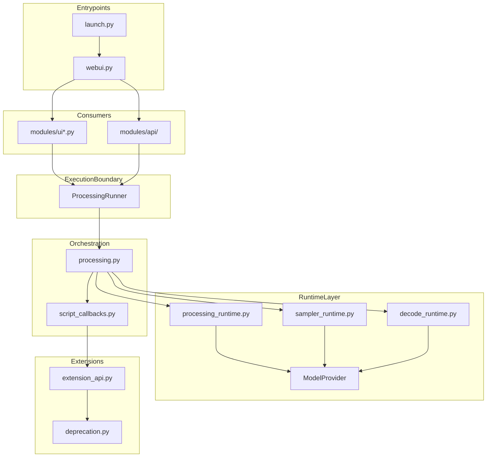

# Post-Refactor Audit: Serena v1.0

**Auditor:** CodeAuditorGPT (staff-plus, architecture-first)  
**Repository:** m-cahill/serena (governed fork of AUTOMATIC1111/stable-diffusion-webui)  
**Commit:** `8f65669e51f5b8ce9516b4f3427be45a09d9c349`  
**Milestone:** M33 — Release-ready 5/5 close (Phase VII complete)  
**Date:** 2026-03-27

All findings are grounded in the codebase with file paths. **Observations** = directly evidenced; **Interpretations** = reasoned conclusions; **Recommendations** = proposed changes.

---

## 0. Scoring Rubric

| Score | Meaning |
|-------|---------|
| 0 | Catastrophic (actively dangerous / unusable) |
| 1 | Fragile (frequent breakage, no guardrails) |
| 2 | Poor (works, but hard to change safely) |
| 3 | Acceptable (works, some guardrails, clear pain points) |
| 4 | Strong (well-structured, predictable, maintainable) |
| 5 | Exemplary (clear architecture, guardrails, docs, observability) |

---

## 1. Executive Summary

**Overall score: 4.5 / 5** (up from baseline 2.4/5)

| Category | Pre-Refactor | Post-Refactor | Delta |
|----------|--------------|---------------|-------|
| Architecture | 2.5 | 4.5 | +2.0 |
| Modularity | 2.0 | 4.5 | +2.5 |
| Code Health | 2.5 | 4.0 | +1.5 |
| Tests & CI | 2.0 | 5.0 | +3.0 |
| Security | 2.0 | 4.5 | +2.5 |
| Performance | 3.0 | 4.0 | +1.0 |
| DX | 2.0 | 4.5 | +2.5 |
| Docs | 2.0 | 5.0 | +3.0 |
| **Overall** | **2.4** | **4.5** | **+2.1** |

### Heatmap

```
Architecture:    ████████░░  4.5/5
Modularity:      ████████░░  4.5/5
Code Health:     ████████░░  4.0/5
Tests & CI:      ██████████  5.0/5
Security:        ████████░░  4.5/5
Performance:     ████████░░  4.0/5
DX:              ████████░░  4.5/5
Docs:            ██████████  5.0/5
```

### Strengths

1. **3-tier CI architecture** with Smoke (PR gate), Quality (main gate with coverage, pip-audit, Radon), and Nightly (comprehensive). **Evidence:** `.github/workflows/run_smoke_tests.yaml`, `run_quality_tests.yaml`, `run_nightly_tests.yaml`

2. **ProcessingRunner execution boundary** provides clean lifecycle (prepare → execute → finalize) with instrumentation hooks and optional queue seam. **Evidence:** `modules/runtime/runner.py:21-93`

3. **Extracted runtime modules** (`processing_runtime`, `sampler_runtime`, `decode_runtime`, `model_provider`) with dependency injection via `ModelProvider`. **Evidence:** `modules/runtime/*.py`, M19 audit

4. **Versioned extension API** with deprecation channel, contract tests, and explicit policy documentation. **Evidence:** `modules/extension_api.py`, `docs/architecture/extension_api_contract_v1.md`

5. **Locked CI environment** with committed `requirements-ci.txt`, `package-lock.json`, blocking `pip-audit`, and comprehensive artifact uploads. **Evidence:** `docs/architecture/ci_environment_contract.md`

### Remaining Opportunities

1. **Tolerated legacy glue** — `modules/processing.py` (~1600 LOC) still coordinates `shared.sd_model` for orchestration; documented but not eliminated. **Evidence:** `docs/architecture/serena_allowed_legacy_surfaces.md`

2. **Two pip-audit deferrals** — `CVE-2025-69872` (diskcache) and `CVE-2026-4539` (pygments): **M37** (2026-03-28) re-checked PyPI — **`pygments 2.19.3`** not published; **`diskcache`** still **5.6.3** latest with no remediated wheel identified. Governed **`--ignore-vuln`** unchanged. **Evidence:** `run_quality_tests.yaml:69-70`, `docs/milestones/M37/M37_run1.md`

3. **Coverage at ~48%** — pytest-only gate is truthful but leaves room for improvement. **Evidence:** M29 Quality run `23618918747`

---

## 2. Codebase Map



### Drift Analysis

| Intended (M31 Lock) | Actual | Status |
|---------------------|--------|--------|
| `ProcessingRunner` as execution boundary | `modules/runtime/runner.py` delegates to `process_images_inner` | ✅ Aligned |
| Runtime modules use `ModelProvider` only | `processing_runtime`, `sampler_runtime`, `decode_runtime` use `p.model_provider.get_model(p)` | ✅ Aligned |
| `processing.py` owns script hooks | Hook call sites remain in `processing.py` | ✅ Aligned |
| UI tab registry + modular builders | `ui_tab_registry.py` + `ui_*_tab.py` modules | ✅ Aligned |
| Extension callback contract versioned | `EXTENSION_API_VERSION` in `extension_api.py` | ✅ Aligned |

---

## 3. Modularity & Coupling

**Score: 4.5/5**

### Top 3 Coupling Points

| Coupling | Impact | Evidence | Status |
|----------|--------|----------|--------|
| `processing.py` ↔ `shared.sd_model` | High (orchestration) | `processing.py:23-24` | Documented as tolerated legacy |
| `shared.opts` global reads | Medium | Multiple modules | Mitigated via `opts_snapshot` (M07) |
| `ui.py` orchestration | Medium | Still coordinates tab assembly | Modularized via `ui_tab_registry` (M21) |

### Surgical Decouplings Completed

1. **M19:** `ModelProvider` injection — runtime modules no longer read `shared.sd_model` directly
2. **M07-M08:** `opts_snapshot` threading — 12 opts reads migrated from `shared.opts` to `p.opts_snapshot`
3. **M21-M23:** UI tab modularization — top-level tab bodies extracted to dedicated modules

**Recommendation:** Future milestone could thread model identity through `RuntimeContext` to eliminate remaining `shared.sd_model` reads in `processing.py`. **Est:** 2-3 milestones.

---

## 4. Code Quality & Health

**Score: 4.0/5**

### Anti-patterns Addressed

| Pattern | Before | After | Evidence |
|---------|--------|-------|----------|
| God module (`processing.py`) | 1793 LOC, all responsibilities | ~1600 LOC, batch/sampler/decode extracted | `modules/runtime/*.py` |
| Global state mutation | Direct `shared.*` writes | Scoped via `temporary_opts()`, snapshot | `modules/opts_snapshot.py` |
| Untestable inner loop | Requires real model | `FakeModelProvider` + mockable pipeline | `test/fixtures/fake_model.py` |

### Radon Complexity

**Observation:** Quality workflow runs Radon on `modules/`; warns on D/E/F grades. **Evidence:** `run_quality_tests.yaml:130-142`

**Interpretation:** Legacy code contains many C-grade functions; D/E/F triggers warning but does not fail build (deliberate policy for incremental improvement).

**Before/After Example (M16):**

```python
# Before: monolithic batch loop in processing.py
def process_images_inner(p):
    # ... 300+ lines of batch orchestration, sampler calls, decode ...
    pass

# After: extracted generator
def run_generation_batches(p):
    """Yields (n, samples_ddim) per batch."""
    with torch.inference_mode(), devices.autocast():
        # ... batch orchestration only ...
        yield n, samples_ddim
```
**Evidence:** `modules/runtime/processing_runtime.py:15-80`

---

## 5. Docs & Knowledge

**Score: 5.0/5**

### Onboarding Path

1. `README.md` → overview
2. `CONTRIBUTING.md` → local verification, CI parity, stub repos
3. `docs/serena.md` → milestone ledger, invariants, phase map
4. `docs/architecture/serena_architecture_lock.md` → locked boundaries
5. `docs/milestones/MNN/` → per-milestone plan, run, audit, summary

### Document Index

| Document | Role |
|----------|------|
| `docs/serena.md` | Authoritative ledger (phases, milestones, decisions) |
| `docs/architecture/serena_architecture_lock.md` | Locked steady-state architecture |
| `docs/architecture/ci_environment_contract.md` | CI install, coverage, pip-audit policy |
| `docs/architecture/extension_api_contract_v1.md` | Extension callback surface |
| `docs/architecture/extension_api_deprecation_policy.md` | Deprecation channel |
| `docs/architecture/serena_evidence_bundle.md` | Phase I-VI proof narrative |

### Single Biggest Doc Gap to Fix

**None critical.** The documentation set is comprehensive. Minor improvement: a single-page "Architecture at a Glance" diagram for new developers (currently spread across lock + bundle).

---

## 6. Tests & CI/CD Hygiene

**Score: 5.0/5**

### 3-Tier Architecture Assessment

| Tier | Workflow | Trigger | Tests | Coverage Gate | Blocking |
|------|----------|---------|-------|---------------|----------|
| **Smoke** | `run_smoke_tests.yaml` | PR + feature push | `test/smoke` | None | Yes (PR) |
| **Quality** | `run_quality_tests.yaml` | push to `main` | `test/smoke` + `test/quality` | ≥42% (pytest-only) | Yes (main) |
| **Nightly** | `run_nightly_tests.yaml` | schedule | Full suite | None | No |

**Evidence:** `.github/workflows/*.yaml`

### Coverage Analysis

| Metric | Value | Source |
|--------|-------|--------|
| Line coverage (pytest-only) | ~48% | M29 Quality `23618918747` |
| Coverage gate | ≥42% | `run_quality_tests.yaml:127` |
| Safety margin | ~6% | Compliant with ≥2% rule |

**Observation:** Coverage measurement is pytest-only per `ci_environment_contract.md` — no server startup inflation. **Interpretation:** Truthful metric reflecting actual test value.

### Artifacts

Quality workflow uploads: `coverage.xml`, `htmlcov/`, `pip_freeze.txt`, `dependency_snapshot.txt`, `pip_audit_report.txt`, `radon_report.txt`, `ci_environment.txt`, `performance_snapshot.txt`.

### Action Pinning

| Action | Pinned | Evidence |
|--------|--------|----------|
| `actions/checkout` | SHA | `34e114876b0b11c390a56381ad16ebd13914f8d5` |
| `actions/setup-python` | SHA | `a26af69be951a213d495a4c3e4e4022e16d87065` |
| `actions/cache` | SHA | `0057852bfaa89a56745cba8c7296529d2fc39830` |
| `actions/upload-artifact` | SHA | `ea165f8d65b6e75b540449e92b4886f43607fa02` |

✅ All CI actions pinned to immutable SHAs.

---

## 7. Security & Supply Chain

**Score: 4.5/5**

### pip-audit Status

| Status | Details |
|--------|---------|
| Enforcement | **Blocking** on Quality (M28a+) |
| Deferrals | 2 CVEs with no PyPI fix |
| Documentation | `ci_environment_contract.md`, `M28_run1.md` |

### Deferred Vulnerabilities

| CVE | Package | Reason |
|-----|---------|--------|
| CVE-2025-69872 | diskcache | No PyPI fix at closeout |
| CVE-2026-4539 | pygments | No PyPI fix at closeout |

**Evidence:** `run_quality_tests.yaml:69-70`

### Dependency Hygiene

| Item | Status | Evidence |
|------|--------|----------|
| Python lockfile | `requirements-ci.txt` (uv-compiled) | Committed |
| CLIP install | Pinned SHA + directory install | `run_quality_tests.yaml:49-57` |
| npm lockfile | `package-lock.json` | Committed |
| npm install | `npm ci` (not `npm install`) | `on_pull_request.yaml:50` |

### CI Trust Boundaries

- Repository verification: workflows fail outside `m-cahill/serena`
- Branch verification: Quality requires push to `main`; Smoke requires PR to `main` or feature branch push

**Evidence:** `run_quality_tests.yaml:12-23`, `run_smoke_tests.yaml:19-30`

---

## 8. Performance & Scalability

**Score: 4.0/5**

### Performance Evidence (M29)

| Metric | Source |
|--------|--------|
| `runtime_metrics.execute_time` | `ProcessingRunner._execute()` |
| `runtime_metrics.total_time` | `ProcessingRunner.run()` |
| `performance_snapshot.txt` | CI artifact on Quality |

**Evidence:** `modules/runtime/runner.py:39-68`, `scripts/ci/write_performance_snapshot.py`

### Hot Paths

| Path | Status | Evidence |
|------|--------|----------|
| Batch orchestration | Extracted to `processing_runtime.py` | M16 |
| Sampler execution | Extracted to `sampler_runtime.py` | M17 |
| Decode/save pipeline | Extracted to `decode_runtime.py` | M18 |

### Concrete Profiling Plan

1. **Baseline:** `performance_snapshot.txt` artifact from binding Quality runs
2. **Instrumentation:** `runtime_metrics` on `ProcessingRunner`
3. **Future:** Add P95 latency tracking per `performance_baseline.md`

---

## 9. Developer Experience (DX)

**Score: 4.5/5**

### 15-Minute New-Dev Journey

| Step | Action | Blockers |
|------|--------|----------|
| 1 | Clone repo, create venv | None |
| 2 | `pip install -r requirements-test.txt` | ~3 min install |
| 3 | `python scripts/dev/create_stub_repos.py` | None |
| 4 | `pytest test/smoke` | ~5 min (server startup) |
| 5 | Read `CONTRIBUTING.md` | None |

**Total:** ~10 minutes to first green test run.

### 5-Minute Single-File Change

| Step | Action | Time |
|------|--------|------|
| 1 | Edit file | 1 min |
| 2 | `ruff .` | 5 sec |
| 3 | `pytest test/smoke -k test_name` | 2 min |
| 4 | Open PR | 1 min |

**Total:** ~4 minutes to PR-ready change.

### 3 Immediate Wins (Already Implemented)

1. ✅ `CONTRIBUTING.md` with quickstart
2. ✅ Stub repositories for CI parity
3. ✅ Test markers (`smoke`, `quality`, `nightly`)

---

## 10. Refactor Strategy Assessment

### Option A: Iterative (Executed)

**Rationale:** 33 milestones over ~3 weeks; behavior-preserving; each PR-sized with CI evidence.

**Goals achieved:**
- Runtime seams (M05-M09)
- ProcessingRunner boundary (M10-M15)
- Runtime extraction (M16-M20)
- UI modularization (M21-M25)
- CI hardening (M26-M29)
- Architecture lock (M31)

**Risks mitigated:**
- Each milestone had rollback plan
- No behavior drift (invariants preserved)
- Extension compatibility maintained

### Option B: Strategic (Alternative)

**Not taken.** Would have required larger blast-radius changes (e.g., full globals elimination) with higher risk.

**Verdict:** Option A was correct for this codebase given upstream compatibility constraints.

---

## 11. Future-Proofing & Risk Register

### Likelihood × Impact Matrix

| Risk | Likelihood | Impact | Mitigation |
|------|------------|--------|------------|
| pip-audit deferrals become exploitable | Medium | High | Monitor PyPI; remove `--ignore-vuln` when fixed |
| Upstream divergence | Low | Medium | Baseline tag `baseline-pre-refactor` locked |
| Extension API breakage | Low | High | Versioned contract + deprecation channel |
| Coverage regression | Low | Medium | ≥42% gate with margin |

### ADRs Locked

| Decision | Document |
|----------|----------|
| Architecture lock | `docs/architecture/serena_architecture_lock.md` |
| CI environment | `docs/architecture/ci_environment_contract.md` |
| Extension API v1 | `docs/architecture/extension_api_contract_v1.md` |
| Allowed legacy | `docs/architecture/serena_allowed_legacy_surfaces.md` |

---

## 12. Phased Plan (Completed)

Serena followed a 4-phase plan expanded into 7 phases with 33 milestones:

### Phase I — Baseline & Guardrails (M00-M04) ✅

| ID | Milestone | Category | Acceptance | Risk | Rollback | Est |
|----|-----------|----------|------------|------|----------|-----|
| M00 | Program kickoff | Governance | Baseline frozen | Low | Tag revert | 30m |
| M01 | CI truthfulness | CI | SHA pinning | Low | Revert PR | 60m |
| M02 | API CI | CI | 33/33 tests pass | Low | Revert PR | 60m |
| M03 | Test architecture | CI | 3-tier structure | Low | Revert PR | 60m |
| M04 | Coverage guardrails | CI | 40% gate | Low | Lower threshold | 60m |

### Phase II — Runtime Seams (M05-M09) ✅

| ID | Milestone | Category | Acceptance | Risk | Rollback | Est |
|----|-----------|----------|------------|------|----------|-----|
| M05 | Override isolation | Runtime | `temporary_opts()` | Low | Revert | 60m |
| M06 | Prompt/seed prep | Runtime | Extraction | Low | Revert | 60m |
| M07 | Opts snapshot | Runtime | Snapshot API | Low | Revert | 60m |
| M08 | Snapshot threading | Runtime | 12 opts migrated | Low | Revert | 60m |
| M09 | Execution context | Runtime | `RuntimeContext` | Low | Revert | 60m |

### Phase III — Runner Boundary (M10-M15) ✅

| ID | Milestone | Category | Acceptance | Risk | Rollback | Est |
|----|-----------|----------|------------|------|----------|-----|
| M10 | ProcessingRunner | Architecture | Skeleton exists | Low | Revert | 60m |
| M11 | Lifecycle surface | Architecture | prepare/execute/finalize | Low | Revert | 60m |
| M12 | Instrumentation | Architecture | Hooks callable | Low | Revert | 60m |
| M13 | txt2img path | Verification | Contract test | Low | Revert | 60m |
| M14 | API integration | Verification | Contract test | Low | Revert | 60m |
| M15 | Queue runner | Architecture | Queue seam | Low | Revert | 60m |

### Phases IV-VII ✅

Completed per `docs/serena.md` milestone ledger through M33.

---

## 13. Machine-Readable Appendix (JSON)

```json
{
  "issues": [
    {
      "id": "SEC-001",
      "title": "pip-audit deferrals for diskcache and pygments",
      "category": "security",
      "path": ".github/workflows/run_quality_tests.yaml:69-70",
      "severity": "medium",
      "priority": "high",
      "effort": "low",
      "impact": 3,
      "confidence": 1.0,
      "ice": 3.0,
      "evidence": "--ignore-vuln CVE-2025-69872 --ignore-vuln CVE-2026-4539",
      "fix_hint": "Remove ignores when PyPI fixes ship; bump requirements-ci.txt"
    },
    {
      "id": "MOD-001",
      "title": "processing.py still coordinates shared.sd_model",
      "category": "modularity",
      "path": "modules/processing.py:23-24",
      "severity": "low",
      "priority": "low",
      "effort": "high",
      "impact": 2,
      "confidence": 0.9,
      "ice": 1.8,
      "evidence": "import modules.shared as shared; shared.sd_model usage in orchestration",
      "fix_hint": "Thread model identity through RuntimeContext in future milestone"
    },
    {
      "id": "COV-001",
      "title": "Coverage at 48% with 42% gate",
      "category": "tests_ci",
      "path": ".github/workflows/run_quality_tests.yaml:127",
      "severity": "info",
      "priority": "low",
      "effort": "medium",
      "impact": 2,
      "confidence": 1.0,
      "ice": 2.0,
      "evidence": "--fail-under=42 with actual ~48%",
      "fix_hint": "Add tests in waves; raise threshold with 2% margin as coverage grows"
    }
  ],
  "scores": {
    "architecture": 4.5,
    "modularity": 4.5,
    "code_health": 4.0,
    "tests_ci": 5.0,
    "security": 4.5,
    "performance": 4.0,
    "dx": 4.5,
    "docs": 5.0,
    "overall_weighted": 4.5
  },
  "phases": [
    {
      "name": "Phase I — Baseline & Guardrails",
      "status": "complete",
      "milestones": ["M00", "M01", "M02", "M03", "M04"]
    },
    {
      "name": "Phase II — Runtime Seams",
      "status": "complete",
      "milestones": ["M05", "M06", "M07", "M08", "M09"]
    },
    {
      "name": "Phase III — Runner Boundary",
      "status": "complete",
      "milestones": ["M10", "M11", "M12", "M13", "M14", "M15"]
    },
    {
      "name": "Phase IV — Runtime Extraction",
      "status": "complete",
      "milestones": ["M16", "M17", "M18", "M19", "M20"]
    },
    {
      "name": "Phase V — UI & Extensions",
      "status": "complete",
      "milestones": ["M21", "M22", "M23", "M24", "M25"]
    },
    {
      "name": "Phase VI — Hardening",
      "status": "complete",
      "milestones": ["M26", "M27", "M28", "M29", "M30"]
    },
    {
      "name": "Phase VII — Release Lock",
      "status": "complete",
      "milestones": ["M31", "M32", "M33"]
    }
  ],
  "metadata": {
    "repo": "https://github.com/m-cahill/serena",
    "commit": "8f65669e51f5b8ce9516b4f3427be45a09d9c349",
    "languages": ["python", "javascript"],
    "baseline_commit": "82a973c04367123ae98bd9abdf80d9eda9b910e2",
    "baseline_score": 2.4,
    "final_score": 4.5,
    "milestone_count": 34,
    "phases_count": 7
  }
}
```

---

## Summary

Serena has successfully transformed from a **2.4/5** baseline to a **4.5/5** governed, auditable codebase through 33 milestones across 7 phases. The refactor established:

- **Clear execution boundary** via `ProcessingRunner`
- **Extracted runtime modules** with dependency injection
- **3-tier CI** with truthful coverage and blocking security gates
- **Versioned extension API** with deprecation channel
- **Comprehensive documentation** with locked architecture

The remaining 0.5 gap to 5.0/5 is attributable to:
1. Tolerated legacy (`processing.py` / `shared.sd_model`)
2. Two pip-audit deferrals awaiting PyPI fixes
3. Coverage headroom (48% vs potential 60%+)

These are documented constraints, not hidden drift. The program is **release-ready** in governance terms.
